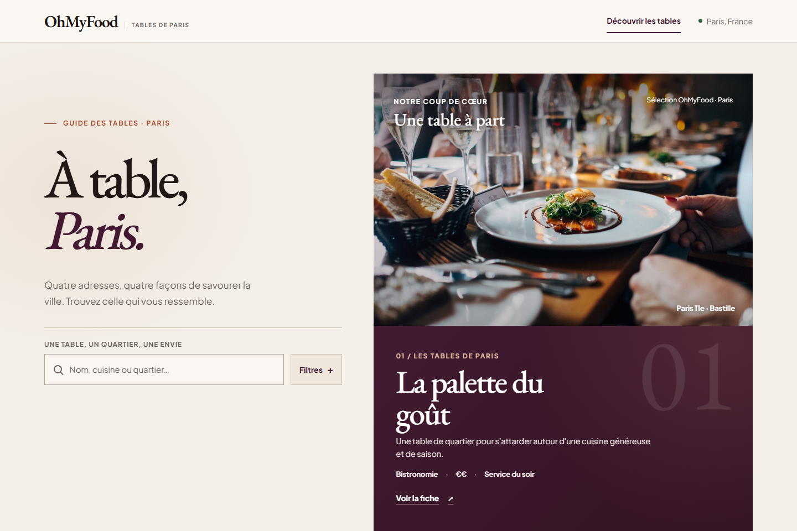
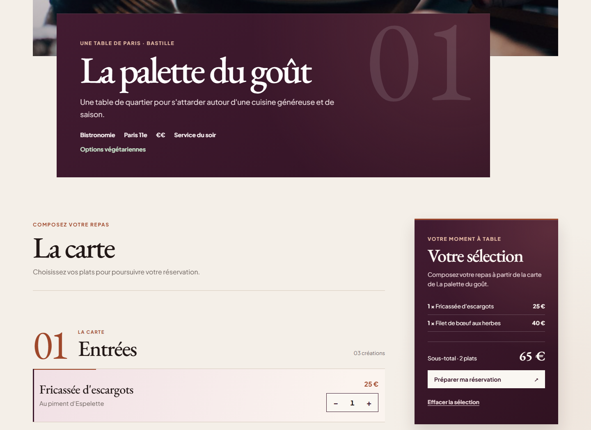
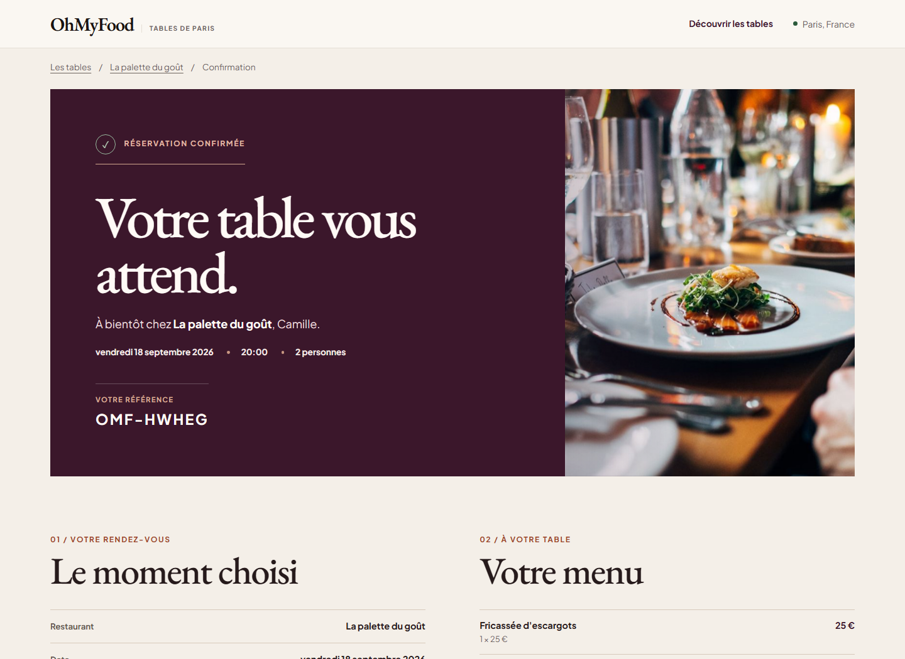

# OhMyFood

OhMyFood V2 is an independent React and TypeScript rebuild of an earlier OpenClassrooms restaurant project, developed on the `ohmyfood-v2` branch. The project transforms the original static concept into a responsive web application featuring editorial restaurant discovery, interactive menu composition, simulated time-slot availability, and session-backed booking confirmation.

## V2 Preview


*Discover page featuring editorial table curation, search, and contextual filters.*


*Restaurant view with live dish selection, quantity controls, and persistent order summary.*


*Confirmation view displaying booking reference, appointment facts, and menu receipt.*

## What changed from V1

| Original OpenClassrooms version (V1) | Independent rebuild (V2) |
| --- | --- |
| Static HTML pages with repetitive markup | Data-driven React architecture with shared typed models |
| Purely decorative CSS dish interactions | Reducer-driven menu selection with persistent storage |
| No application state or filtering | URL-synchronized filters, React Context, and browser storage |
| Restaurant journey ended at the menu | Guided reservation flow with availability and confirmation |
| Basic responsive layout and large assets | Mobile-first editorial layouts and optimized self-hosted assets |
| Minimal keyboard and screen-reader support | Skip navigation, route focus management, and ARIA announcements |
| Generic mock styling | Editorial visual direction with custom typography and curated palettes |

The original OpenClassrooms jury submission and its history remain untouched on `main`, `archive/v1-openclassrooms`, and tag `v1.0.0-openclassrooms`.

## Product journey

The customer flow covers five connected stages:

1. **Discover:** Search and filter Paris tables by neighborhood, cuisine, or dietary options.
2. **Restaurant:** Review restaurant ambiance, culinary focus, and seasonal course chapters.
3. **Menu selection:** Select dishes with quantity controls, live subtotal updates, and multi-table replacement guards.
4. **Reservation:** Choose party size, select from simulated real-time availability slots, and provide contact details.
5. **Confirmation:** Review the confirmed appointment facts, generated booking reference, and menu receipt.

## Technical stack

- **Core:** React 19, TypeScript, Vite
- **Routing:** React Router (hash routing for static host compatibility)
- **Typography:** Self-hosted variable fonts (`@fontsource-variable/eb-garamond`, `@fontsource-variable/plus-jakarta-sans`)
- **Testing:** Vitest (30 unit and integration tests)
- **Styling:** Native modular CSS with design tokens, responsive containers, and motion queries

## State & interaction architecture

State is scoped to its natural lifecycle without external state management libraries:

- **URL Search Parameters:** Holds Discover filters (`q`, `cuisine`, `neighborhood`, `dietary`) for bookmarkable views.
- **Selection Context (`useReducer`):** Manages active dish quantities and totals for the selected restaurant.
- **`localStorage` (`omf_selection_v2`):** Persists an in-progress meal selection across sessions; prompts before replacing if switching restaurants.
- **Component State:** Drives reservation form validation and the asynchronous availability lifecycle (`initial` → `loading` → `success` / `empty` / `error`).
- **`sessionStorage` (`omf_confirmation_v2`):** Stores the confirmed booking snapshot for the active browser session.

## Accessibility

- Semantic HTML5 structure across all routes (`main`, `nav`, `header`, `section`, `article`, `aside`).
- Skip navigation link to bypass the header on desktop and mobile.
- Route focus management shifting focus to primary content headings upon navigation.
- Accessible form controls with explicit labels, constraints, and `aria-describedby` error associations.
- Live region announcements (`aria-live="polite"`) for asynchronous time-slot lookups.
- Full support for `prefers-reduced-motion` via CSS overrides and reveal hooks.

## Running locally

```bash
# Clone the repository
git clone https://github.com/DRGYZ/OhMyFood.git
cd OhMyFood

# Switch to the V2 working branch
git checkout ohmyfood-v2

# Install dependencies and start development server
npm install
npm run dev

# Run quality checks and tests
npm run typecheck
npm test
npm run build
npm run preview
```

## Deployment status

- **V1 Deployment:** The original OpenClassrooms submission remains publicly hosted on GitHub Pages at [drgyz.github.io/OhMyFood](https://drgyz.github.io/OhMyFood/).
- **V2 Deployment:** OhMyFood V2 is **not currently publicly deployed**. It can be run and evaluated locally from the `ohmyfood-v2` branch.

## V1 preservation

The original OpenClassrooms jury submission is preserved in full:
- `main`: Untouched submission branch.
- `archive/v1-openclassrooms`: Archival branch pointing to the original baseline.
- `v1.0.0-openclassrooms`: Git tag marking the exact evaluated submission.

Historical project context is documented in [the V1 baseline](docs/v1-baseline.md). Architectural decisions are recorded in [the V2 design foundation](docs/v2-design-foundation.md).

## Data & project scope

All restaurant identities, dish descriptions, and pricing are illustrative concept data descending from the original course scenario. Time-slot availability is simulated locally with deterministic delays and edge cases; no backend service, external database, or payment processing exists.
